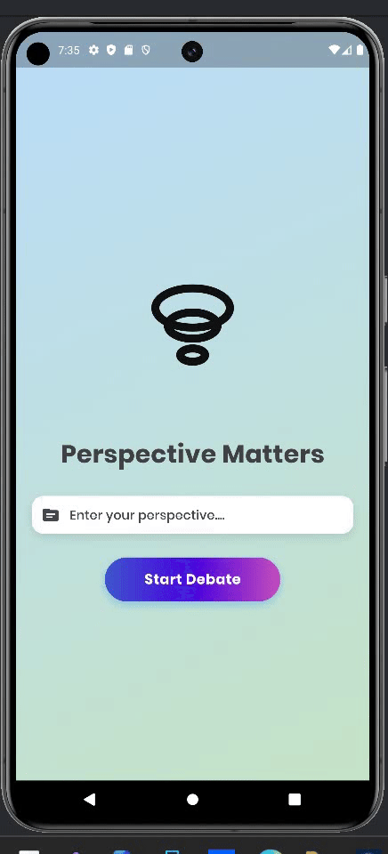

# Perspective Matters 🤔

> "The real voyage of discovery consists not in seeking new landscapes, but in having new eyes." - Marcel Proust
> 

## About the Project 🌟

Perspective Matters is a groundbreaking Flutter application that revolutionizes the way we engage with differing viewpoints. By leveraging the power of Google's Gemini AI, this app creates an intelligent debate platform where two AI agents engage in structured discourse, challenging our preconceptions and broadening our understanding of complex topics.

### Why Perspective Matters? 🤷

In today's polarized world, we often struggle to understand viewpoints that differ from our own. This app isn't about validating every perspective – it's about understanding how different viewpoints are constructed and defended, even when they might seem implausible or controversial. Whether it's exploring serious societal debates or examining unconventional theories, Perspective Matters helps users:

- 🧠 Develop critical thinking skills
- 🗣️ Understand the structure of arguments
- 🤝 Bridge ideological divides
- 🎯 Identify logical fallacies
- 📚 Explore diverse reasoning patterns

## How It Works 🛠️

### 1. Topic Validation
- User inputs a debate topic
- Gemini AI performs intelligent filtering
- Screens out inappropriate or dangerous topics
- Ensures meaningful discourse parameters

### 2. Dual AI Debate System
```
User Input → Validation → Pro AI Agent ⚔️ Con AI Agent → Structured Debate
```

### 3. Safety Features
- Smart content filtering
- Automatic redirection for invalid topics
- Warning system for potentially harmful content
- Structured debate parameters

## Technical Architecture 🏗️

- **Frontend**: Flutter
- **AI Engine**: Google Gemini API
- **Debate Flow**:
  - Topic Validation Layer
  - Pro Argument Generation
  - Counter-Argument Processing
  - Interactive Debate Interface

## Key Features ✨

- 🤖 Dual AI Agent System
- 🛡️ Smart Content Filtering
- 💭 Real-time Debate Generation
- 🔄 Dynamic Response System
- 🎯 Focused Topic Management
- 📊 Structured Argument Flow

## Philosophy Behind the App 📚

Perspective Matters isn't just another debate app – it's a tool for intellectual exploration. By allowing AI agents to debate even seemingly implausible positions (like some extremely stupid ideas), users can:

1. Understand the construction of arguments
2. Identify logical patterns and fallacies
3. Develop stronger critical thinking skills
4. Practice intellectual empathy
5. Explore the boundaries of rational discourse


## Future Roadmap and Improvements Needed 🗺️

- [ ] Imrpoved Realistic AI Voices
- [ ] Custom Debate Parameters
- [ ] Need to add user authentication
- [ ] Setup proper databases and store Debate Transcripts
- [ ] Overall needed to make this production ready


## Contact 📫

Have questions? Reach out!
- GitHub Issues: [Create an issue](https://github.com/yourusername/perspective-matters/issues)
- Email: contactashharps@gmail.com

---

*"The highest form of intelligence is the ability to observe without evaluating." - Jiddu Krishnamurti*
